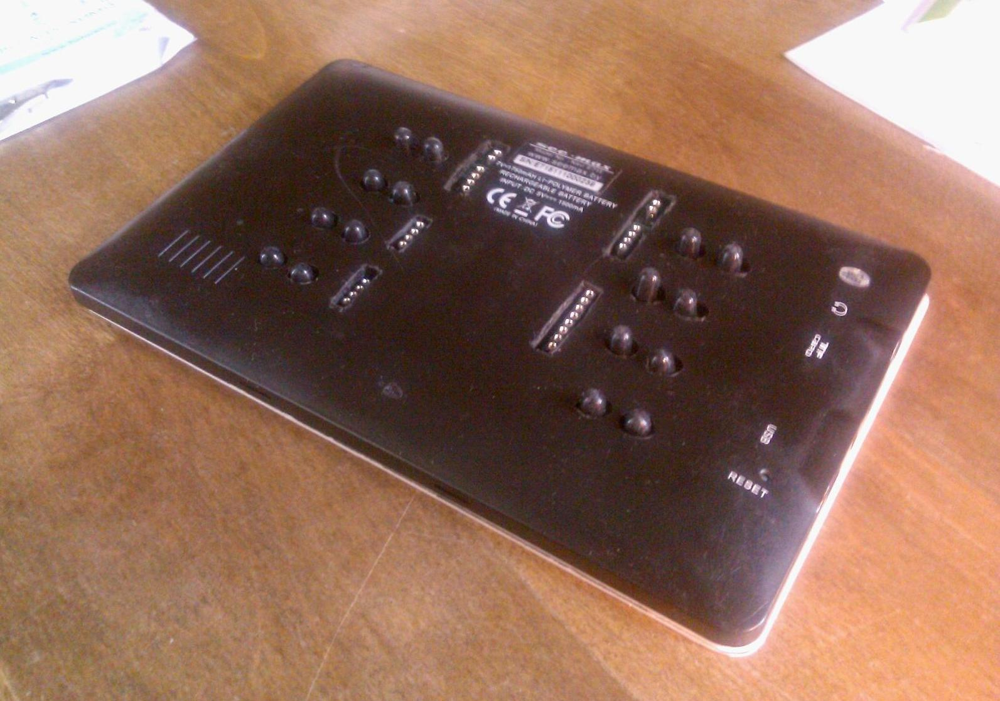
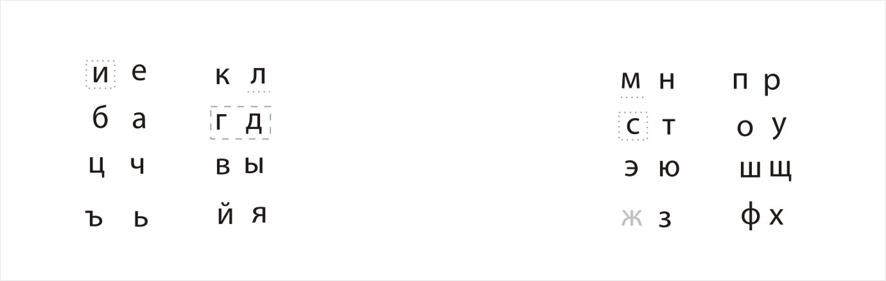
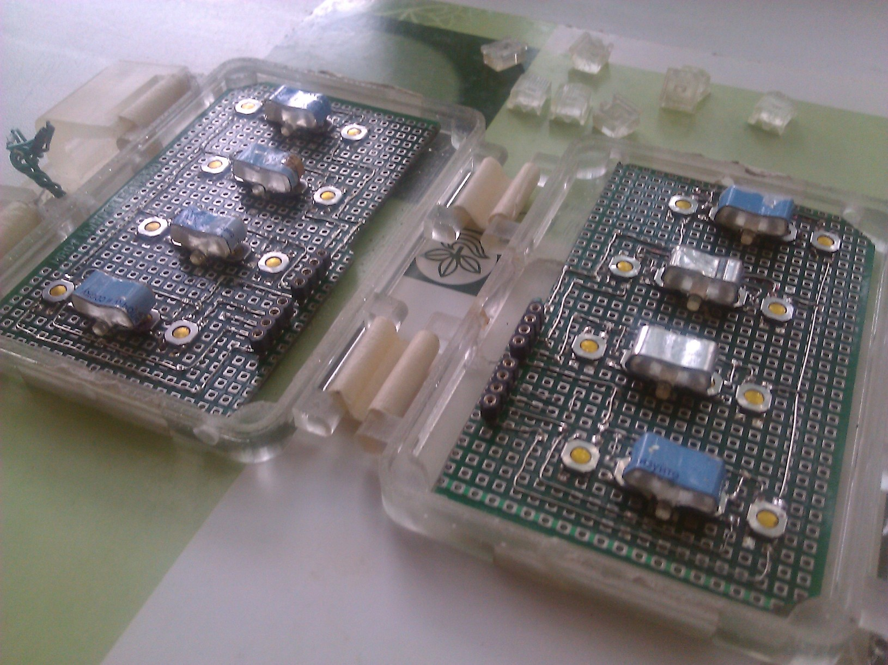
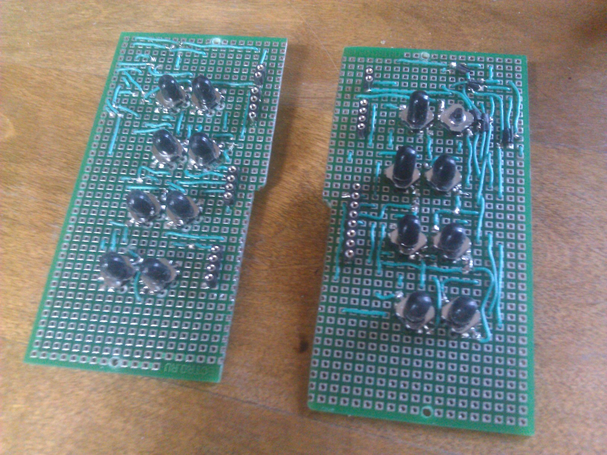
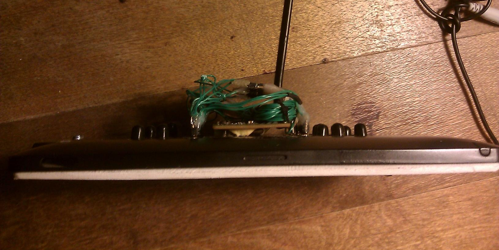
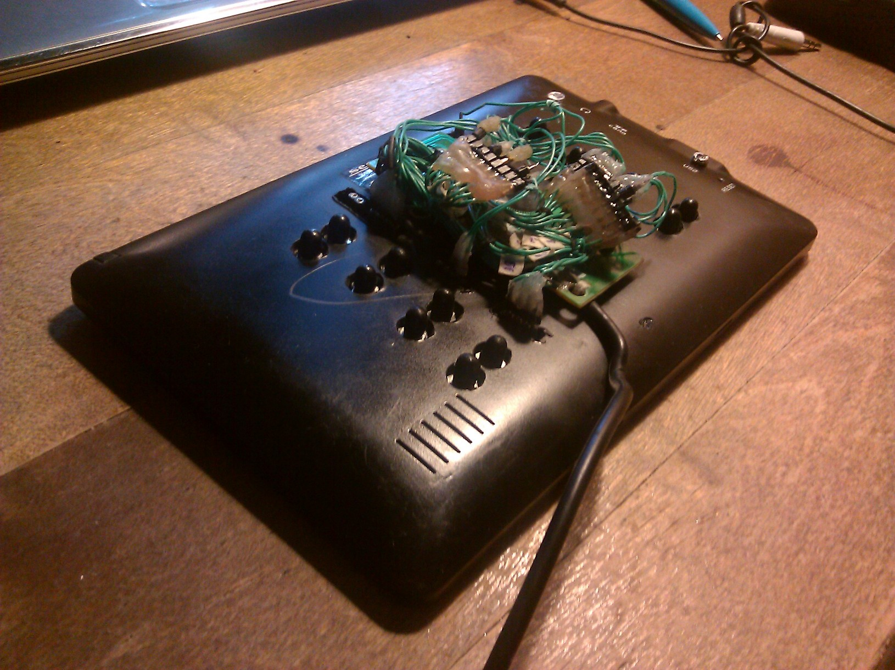
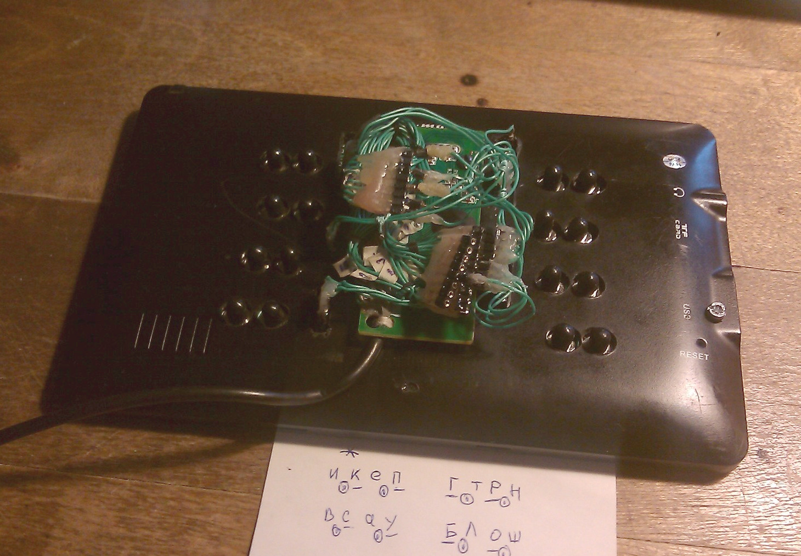
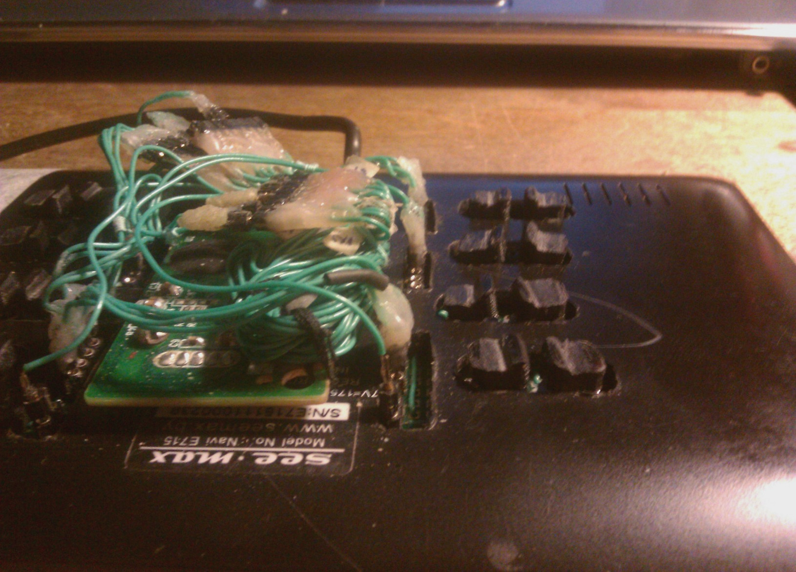

# х16

Автор: [oxxx](./Authors/oxxx.md)

## Тип
эксперементальная, backtype, две двухпозиционные клавиши на палец

## Контроллер и компаненты
штатный контроллер неизвестной китайской клавиатуры 

## Прошивка
Клавиатура работала только в системе Windows (хотя работа из-под Linux возможна, если создать и загрузить специальную раскладку). Поэтому использована прошивка стандартной клавиатуры. Символы измененялись на уровне ОС с помощью Windows Keyboаrd Layout Editor.

## Раскладки, функции, особенности
клавиатуры работала только в нижнем регистре на одном языке,
без цифр и знаков препинания
  

## Доки и гайды
клавиатура не предполагала её повторения, поэтому документация отсутствует

## История и идеалогия проекта
Клавиатура была создана (август 2016) в рамках проверки возможности back-type печати. Предшественником её была [noname backtype rev.2](./Keyboards/noname_backtype)(весна-лето 2014) с качельной клавишей по середине каждого ряда.
  

В качестве свичей использованы 5-позиционные джойстики поверхностного монтажа.
Сначала был сделан вариант с окгуглыми кнопками с резиновым покрытием, потом - с изготовленными на 3D-принтере, с вырезами для лучшего "зацепа".
Исходное положение пальца - между кнопками. 

## Аналоги
[Волькина](ссылка)  
[Волькина #2](ссылка)

## Публикации и ссылки
[На Хабре - про клавиши на обратной стороне планшетов](https://habr.com/ru/post/392081/)
