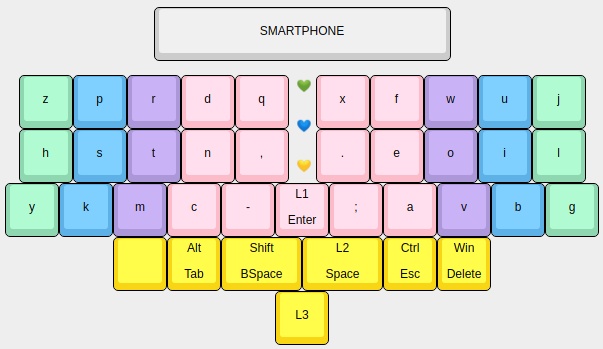

требует правки!!!

## Наши клавиатуры

### Существующие
* **CatBoard** — первая отечественная эргоклавиатура. [Репо](https://github.com/ibnteo/catboard), [лендинг](http://catboard.klava.org/).
* **kKeyb** &mdash; эргономичный 60% сплит, текущий вариант монолитный. [Прошивка и картинки](https://github.com/Steve-Key/QMK_kKeyb19).
* **Лучеклава** &mdash; похожа на лучи. [Пост](https://t.me/klavaorgwork/62685).
* **Jian** — 40% сплит, ориентированный на кириллицу. [Пост](https://t.me/KgOfHedgehogs/12).
* **Jiran** — модификация Jian с отламывающимися цифрами. [Репо](https://github.com/Ladniy/jiran-breakoff)
* **Вакидзаси** — однорукая клавиатура с большим количеством аккордов. [Репо](https://github.com/bouncepaw/wakizashi), [статья](https://bouncepaw.github.io/wakizashi-ru).
* **Кладенец2** — клавиатура, построенная на одновременном наборе нескольких пятибитовых аккордов. Развита в Кл23.
* **Кладенец23** &mdash; полиаккордовая полисимвольная однорукая клавиатура. [Репо](https://github.com/ibnteo/kladenets).
* **Секира** — клавиатура, смешивающая в себе аккордовые и обычные эргоклавы. [Репо](https://github.com/bouncepaw/sequira), [статья на английском](https://bouncepaw.github.io/sequira-en).
* **Sparkle** — клавиатура, у которой тамбы в два ряда: нижний на чоках, верхний на черри.
* **Сагарис** — идейное продолжение Секиры, вдохновлённое Sparkle. Гибридный стаггер впервые сделан здесь. [Репо](https://github.com/bouncepaw/sagaris)

### Не совсем клавы
* **Шакрам** — крутилка с ручкой, которую крутишь, и она меняет громкость на компьютере. [Репо](https://github.com/bouncepaw/chakram).

### Концепты
* Ладошки — в форме ладоней, кнопки из пуговиц.
* Квази 42 — первая клавиатура с кнопкой «Квази».
* Буран — сферическая Однорукая клавиатура в вакууме буквально. Предполагает нулевое движение кистями.
* Кладенцы первого поколения (тупиковая ветвь).
* Аккордеонум — аккордовая клава на цифровой клавиатуре 3\*3 + тамб.
* Судаку — клава в стиле судоку. Есть реализация на андроид. Туду: добавить ссылку.
* К-36. Есть реализация на андроид. Туду: добавить ссылку.
* Гезотайп (К730)
* Корд. Одноручная. 8 фингеров, 1 тамб. Аккордом вводится сканкод напрямую.
* Сюрикен. Поликкордовая, полибуквенная, похожа на сюрикен.
* Мечелом. Полиаккордовая, полибуквенная. Включает в себя кнопки «Квази» и «Астра».
* [Идеальная клавиатура optozorax'а.](https://t.me/klavaorgwork/12906)
* Махаллейнир. Что-то вроде компактной версии Секиры, но предназначенная для телефона.
  
  

